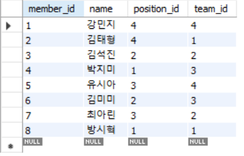
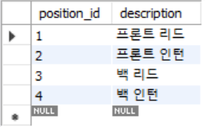
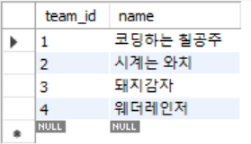
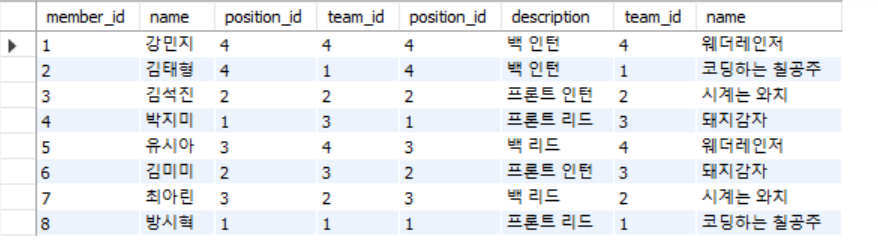

21.04.10 Week4 back seminar
=====

# 01. MySQL
-----
## 1. Table
### 1) members table


### 2) position table


### 3) team


## 2. Code
```sql
SELECT * FROM efub.members
inner join position on position.position_id = members.position_id
inner join team on team.team_id = members.team_id;
```

## 3. Output



# 02. AWS
-----
## 1. Original picture


## 2. Resized picture

